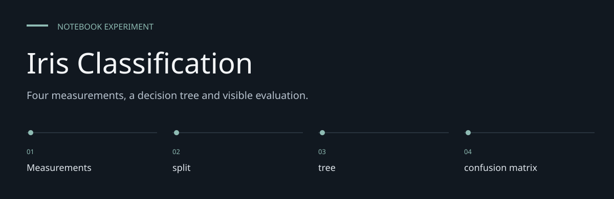
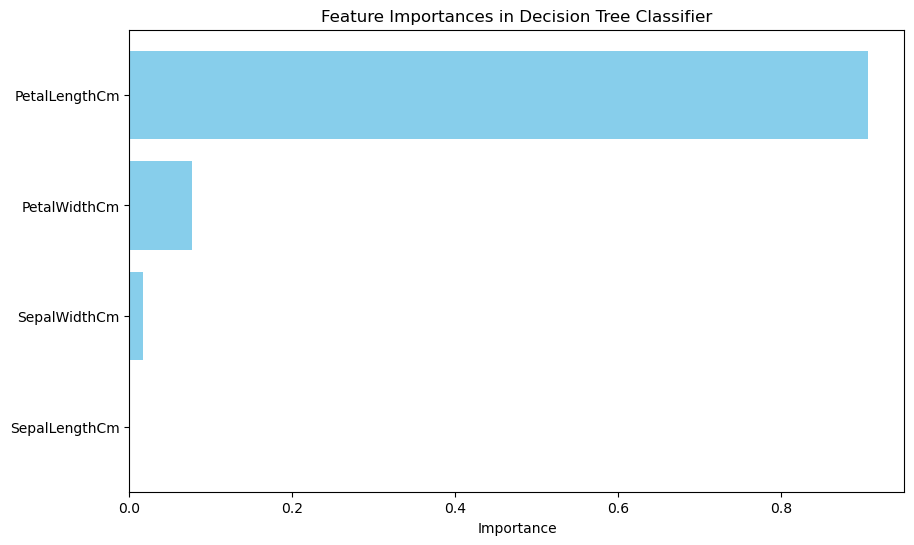
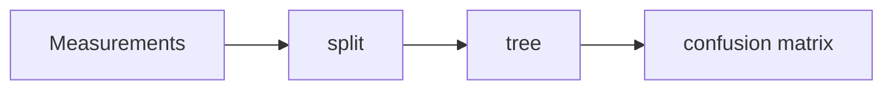

# Iris Classification

**Four measurements, a decision tree and visible evaluation.**

> Four flower measurements, one decision tree, and an explicitly limited recorded evaluation.

[Task_1.ipynb](Task_1.ipynb) inspects an Iris CSV, encodes its species labels, trains a decision
tree and prints classification metrics. It also plots feature importance and classifies one sample.
This is an educational notebook rather than a deployed identification system.


[Architecture](docs/ARCHITECTURE.md) · [Evaluation guide](docs/EVALUATION.md)

**Contents:** [The challenge](#the-challenge) · [Walkthrough](#walk-through-the-project) ·
[Implementation](#implementation-state) · [Design choices](#engineering-choices) ·
[Next evidence](#next-evidence-to-collect)

---

## The challenge

Iris flower measurements provide an approachable way to inspect the relationship between inputs
and Species. This repository keeps that work in a notebook so preparation, computation and saved
outputs can be read together. Its value is an inspectable experiment, not a deployed prediction
service.



*Historical output embedded in [Task_1.ipynb](Task_1.ipynb), cell 12. Extracted unchanged from the
notebook; not a fresh experiment result.*

## System at a glance



## Walk through the project

### 1. Supply the input data

The required CSV files are not tracked. Obtain an authorized copy with the expected schema and
replace the author-specific absolute paths before execution.

### 2. Inspect the preparation

Import cells appear after first use and must run first in a clean kernel. Review the
transformations and exclusions before rerunning; an output cannot be understood separately from
its input preparation.

### 3. Run the experiment

The implemented method is DecisionTreeClassifier. The tree has no fixed random seed. Execute in a
fresh kernel to reveal ordering and dependency problems.

### 4. Read the diagnostics

The saved confusion matrix records 30/30 correct on one historical holdout. That is one small
split, not a generalization guarantee. The identifier column is excluded from predictive features.

## Inspect and reproduce

Read the saved outputs on GitHub. For execution, install the imported packages in a local
environment:

```sh
python3 -m venv .venv
.venv/bin/python -m pip install jupyterlab pandas matplotlib scikit-learn
.venv/bin/python -m jupyter lab Task_1.ipynb
```

**Two preparation steps are required.** The matching `Iris.csv` is absent; obtain it separately and
replace the machine-specific `file_path`. Also run the scikit-learn and matplotlib import cells
before their first use: those imports currently occur near the end, so a top-to-bottom clean-kernel
run will encounter undefined names. This README documents the required preparation without changing
the original notebook.

Expected columns: `Id`, `SepalLengthCm`, `SepalWidthCm`, `PetalLengthCm`, `PetalWidthCm`, `Species`.
Dependency versions and dataset provenance/licensing are not pinned in this repository.

## Workflow and saved results

`CSV → inspection → species encoding → four measurement features → split → tree → metrics`.
`Id` is excluded from the features. The split uses 80% training and 20% test with `random_state=42`.

| Measure | Saved evidence |
|---|---|
| Dataset rows | 150 |
| Test rows | 30, with class supports 10 / 9 / 11 |
| Correct classifications | 30/30 in the saved confusion matrix |
| Recorded accuracy | 1.0 on this split |
| Example | [5.1, 3.5, 1.4, 0.2] classified as Iris-setosa |

Outputs were inspected on **7 October 2026**. They were not rerun: the input CSV is absent and the
cell order needs preparation. The classifier's own random seed is not fixed. The score is a
historical split result, not evidence of perfect classification on other measurements.

## Scope and limits

Built: data inspection, label encoding, decision-tree training, classification report, confusion
matrix, feature-importance plot and a sample prediction. Missing: supplied data, locked environment,
automated tests, serialized model, independent validation and a serving interface.

Both `Iris_flower_classifcation` and `Iris-flower-classification-model` contain this notebook-based
exercise; evaluate the checked-in file rather than assuming the repository names imply different
model implementations.

## Engineering choices

**Inputs are explicit.** SepalLengthCm, SepalWidthCm, PetalLengthCm, PetalWidthCm.

**Method is inspectable.** DecisionTreeClassifier is the implemented method; no broader modeling
capability is inferred.

**Historical evidence is labeled.** The saved confusion matrix records 30/30 correct on one
historical holdout. That is one small split, not a generalization guarantee.

## Implementation state

| State | Current evidence |
| --- | --- |
| Present | Notebook source and historical saved outputs |
| Required externally | Authorized CSV input and compatible Python packages |
| Not rerun | Data-dependent execution in this documentation pass |
| Not supplied | Deployment service, model registry or automated behavior suite |

The [architecture guide](docs/ARCHITECTURE.md) maps these statements to source entry points.
The [evaluation guide](docs/EVALUATION.md) separates inspection, executable checks and
domain validation, with the next evidence needed for each project.

## Next evidence to collect

- Supply data provenance and a reproducible local path.
- Record a fresh-kernel run with package versions.
- Evaluate stability across independent samples before widening any performance claim.
